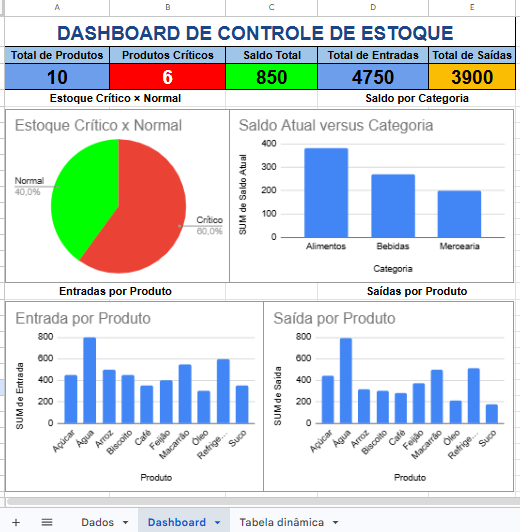

# 📦 Dashboard de Controle de Estoque

Projeto desenvolvido utilizando **Google Sheets** para análise e controle de estoque por meio de **KPIs, Tabelas Dinâmicas e Dashboard Interativo**.

---

## 🎯 Objetivo

Desenvolver um painel gerencial para monitorar indicadores de estoque, permitindo acompanhar entradas, saídas, saldo disponível e produtos críticos, auxiliando na tomada de decisão logística.

---

## 📊 Indicadores (KPIs)

- 📦 Total de Produtos
- ⚠️ Produtos Críticos
- 📈 Saldo Total em Estoque
- 📥 Total de Entradas
- 📤 Total de Saídas

---

## 📈 Dashboard

O dashboard apresenta os seguintes gráficos:

- 🍕 **Estoque Crítico x Normal**
- 📊 **Saldo por Categoria**
- 📈 **Entradas por Produto**
- 📉 **Saídas por Produto**

Todos os gráficos foram construídos utilizando **Google Sheets** e **Tabelas Dinâmicas**, permitindo uma análise rápida e intuitiva dos dados.

---

## 🛠️ Ferramentas Utilizadas

- Google Sheets
- Tabelas Dinâmicas
- Gráficos Dinâmicos
- Indicadores Logísticos (KPIs)
- Análise de Dados

---

## 💡 Análises Realizadas

- Identificação de produtos críticos
- Controle de saldo por categoria
- Comparação entre entradas e saídas
- Monitoramento da movimentação de estoque
- Apoio à tomada de decisão operacional

---

## 🚀 Competências Demonstradas

- Análise de Dados
- Gestão de Estoque
- Indicadores Logísticos
- Google Sheets
- Dashboards Gerenciais
- Business Intelligence

---

## 📷 Dashboard

> Insira aqui uma imagem do dashboard.

Exemplo:

```markdown

````

---

## 👨‍💻 Autor

**Wanderson Oliveira Carneiro**

Profissional de Logística | Controle de Estoque e Inventário | Estudante de Gestão da Tecnologia da Informação | Análise de Dados e Business Intelligence

---

⭐ Projeto desenvolvido para compor meu portfólio de Análise Logística e Dados no GitHub e LinkedIn.

```
```
