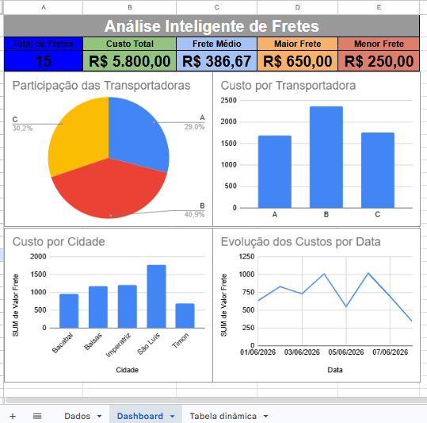

# 🚛 Análise Inteligente de Fretes

Dashboard desenvolvido no **Google Sheets** para análise de custos logísticos, utilizando **KPIs, Tabelas Dinâmicas e Gráficos Gerenciais** para apoiar a tomada de decisão.

---

## 🎯 Objetivo

Analisar os custos de transporte e identificar padrões de desempenho das transportadoras e regiões atendidas, permitindo uma visão estratégica dos gastos com frete.

---

## 📊 Indicadores (KPIs)

O dashboard apresenta os seguintes indicadores:

- 🚚 Total de Fretes
- 💰 Custo Total de Fretes
- 📈 Frete Médio
- 🔺 Maior Frete
- 🔻 Menor Frete

---

## 📈 Dashboard

O painel foi desenvolvido utilizando **Google Sheets** e contém visualizações que facilitam a análise dos custos logísticos.

### Gráficos disponíveis:

- 🍕 Participação das Transportadoras
- 📊 Custo por Transportadora
- 📊 Custo por Cidade
- 📈 Evolução dos Custos por Data

---

## 🛠️ Ferramentas Utilizadas

- Google Sheets
- Tabelas Dinâmicas
- Gráficos Dinâmicos
- KPIs Logísticos
- Análise de Dados
- Dashboard Executivo

---

## 💡 Análises Realizadas

- Comparação dos custos entre transportadoras
- Análise dos custos por cidade
- Evolução diária dos gastos com frete
- Distribuição da participação das transportadoras
- Identificação de oportunidades para redução de custos logísticos

---

## 🚀 Competências Demonstradas

- Análise de Dados
- Logística
- Indicadores de Performance (KPIs)
- Google Sheets
- Dashboards Gerenciais
- Business Intelligence
- Tabelas Dinâmicas
- Visualização de Dados

---

## 📷 Dashboard

Adicione uma captura de tela do dashboard nesta seção.

Exemplo:


```


## 👨‍💻 Autor

**Wanderson Oliveira Carneiro**

Profissional de Logística | Controle de Estoque e Inventário | Estudante de Gestão da Tecnologia da Informação | Análise de Dados | Business Intelligence

---

⭐ Projeto desenvolvido para compor meu portfólio profissional de Logística e Análise de Dados, demonstrando habilidades em construção de dashboards e geração de indicadores estratégicos para apoio à tomada de decisão.
````

